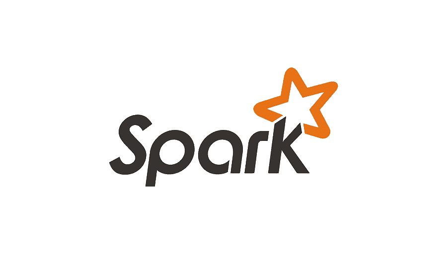

# Distributed-vs-nonDistributed-ML
 

A comparison between distributed methods such as Spark and non-distributed ones for a machine learning task in order to analyze the results obtained.

## Prerequisites
- Ubuntu (23.04)
- Python (3.13.3)
- Hadoop (3.4.1)
- Spark (3.5.5)
- Dask (2025.4.0)
- Java (8)
- Jupyter notebook
- Google Cloud Platform

## Goals
The dataset used in the project [Kaggle] (https://www.kaggle.com/datasets/hopesb/student-depression-dataset), contains data aimed at analyzing, understanding, and predicting depression levels among students. Some of the features included in the dataset are information such as demographic , academic performance ,  mental health history, lifestyle habits and responses to standardized depression scales.

The aim in the project is to perform a binary classification on the data in order to predict if a student suffer from depression or not. The column being analyzed is labeled "Depression" in the dataset, where a value of 1 indicates the presence of depression and 0 indicates its absence.

Three scripts have been created for the comparison:

[1. Spark Script on single VM] (src/Spark/SparkOnSingleVM.ipynb) Development on GCP, with a single VM consisting of 4 vCPU and 16GB of RAM, data loaded via HDFS.

[2. Spark Script in a cluster] (src/Spark/SparkOnCluster.ipynb) Development on GCP, with a cluster consisting in 3 VM, 1 master and 2 worker, each with 2vCPU and 4GB of RAM.

[2. Dusk Script in a cluster] (src/Dusk/DuskOnSingleVM.ipynb) Development on GCP, with a single VM consisting of 4 vCPU and 16GB of RAM, using Dask for the parallelization + sklearn.

[3. Non-distributed Script] (src/classic_implementation/NotDistributed.ipynb) Local development on a machine.

The EDA phase has been done in a separate script to not affect the result (src/EDA/DepressionClassification.py)

## How to use
The non-distributed script can be executed on a machine without any virtual machine (VM).
The script using Spark on a cluster requires setting up a cluster on GCP; in this case, the cluster was built using Dataproc and requires enabling the necessary APIs from the GCP console.
The script using Spark on a single VM can be executed on a properly configured local VM. However, if the environment has very limited resources — as in this case — it is possible to create a VM on GCP, set it up via the SSH console, and then access Jupyter from the local machine through an SSH tunnel in order to execute the code.
To run the Dask script, it is necessary to install the Dask library in the previously created virtual environment.
